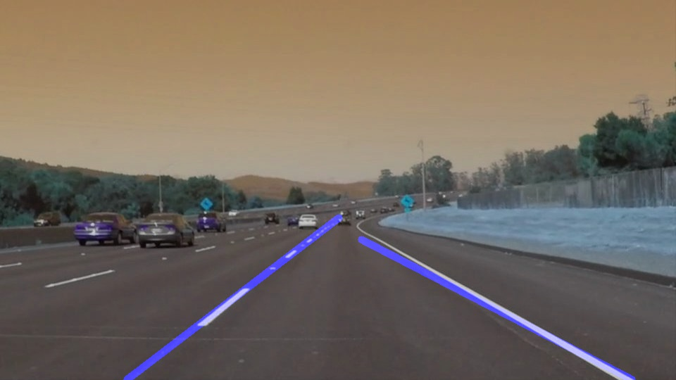

# **Finding Lane Lines on the Road** 

## Writeup Template

### You can use this file as a template for your writeup if you want to submit it as a markdown file. But feel free to use some other method and submit a pdf if you prefer.

---

**Finding Lane Lines on the Road**

The goals / steps of this project are the following:
* Make a pipeline that finds lane lines on the road
* Reflect on your work in a written report

[//]: # (Image References)

[image1]: ./examples/grayscale.jpg "Grayscale"

---

### Reflection

### 1. Describe your pipeline. As part of the description, explain how you modified the draw_lines() function.

My pipeline consisted of 5 below steps.

  1. Conversion the images to grayscale.
  2. Define a kernel size and apply Gaussian smoothing on grayscale image. I got blur grey image object after it.
  3. Define our parameters(thresholds) for Canny and apply it to image
  4. Define the Hough transform parameters, get reason of interest masked image and apply Hough transformation with draw lines.
  5. Merge the original image with transformed image and get the final detected lined image.

In order to draw a single line on the left and right lanes, I modified the draw_lines() function by calculating slope and make coordinates lists of left and right lanes. Using these lists, we are finding minimum Y and maximum Y cordinates for both of lanes. These min & max coordinates further used to calculate average X for both of lanes using polyfit function and slope calculated results. After get all the required data to draw lines, we are passing values to cv2.line function to draw lane lines. This changed draw_lines() function gives flexibility in drawing lines more stable and better than default one.

Original Image:

Transformed Image after Detect Lane Lines:

### 2. Identify potential shortcomings with your current pipeline

This program is elementory or too basic to understand the computer vision for driverless vehicles. This has a lot of shortcomings but in this scenario(elementory training), we lack of the following shortcomings.

One potential shortcoming would be what would happen when any white or off-white object come between of the road lanes. If this object comes under region or area of iterest vertices, this is measured as part of lane lines.

Another shortcoming could be happen when shadow and contrast are available in the image. In this case, the program can get confused between the lane lines and the contrast of the image and calculate coordinates incorrectly to draw lines.

In heavy traffic conditions, there must be another logic to guide the vehicle for movement as this method is not sufficient to take decisions to go in particular right direction.

### 3. Suggest possible improvements to your pipeline

A possible improvement would be to get median of the list of lane lines block lengths. This averate length can be used to compare the length of all detected lane lines. During compare the lane line block lengths, If any block have more discrepancy in lenght, it can be consider as outer object from the lane line and can be ignored. This improvement can help to get more closer results.

